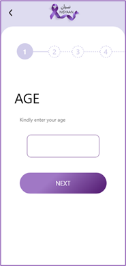
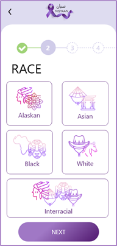
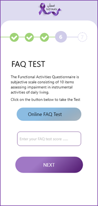

# AD-Risk-Prediction-API
An API that was built to predict the risk of Alzheimer's Disease using specific factors. The API integrated with an Android mobile app.
# Android Mobile App
This app is linked to the API which collects inputs from the user and the API works as a bridge sending the inputs to the Model and vice versa. 
  
 
 
 
 

